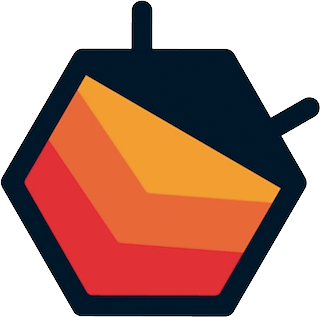

# Central de Erros
Projeto Final Codenation - Acelera Dev React ( Central de Erros ) 


[![NPM Version][npm-badge]][npm-url]


## Ferramentas 
* [Visual Studio Code](https://code.visualstudio.com/)
* [Yarn](https://yarnpkg.com/)
* [NodeJs](https://nodejs.com)
* [Bootstrap](https://getbootstrap.com/)
* [Firebase](https://firebase.google.com/)
* [ReactJs](https://pt-br.reactjs.org/)

( Dependências ) :
  - Firebase
   ```bash
  $ yarn install firebase
  ```
  - React Router Dom ( Gerenciador de Rotas )
  ```bash
  $ yarn add react-router-dom
  ```
  - React ToastFy ( Gerador de Mensagens em Toasts )
  ```bash
  $ yarn add react-toastify
  ```
  - Redux
  ```bash
  $ yarn add react-redux redux
  ```


[npm-badge]:https://img.shields.io/npm/v/generator-oss-project.svg
[npm-url]: https://www.npmjs.com/package/generator-oss-project